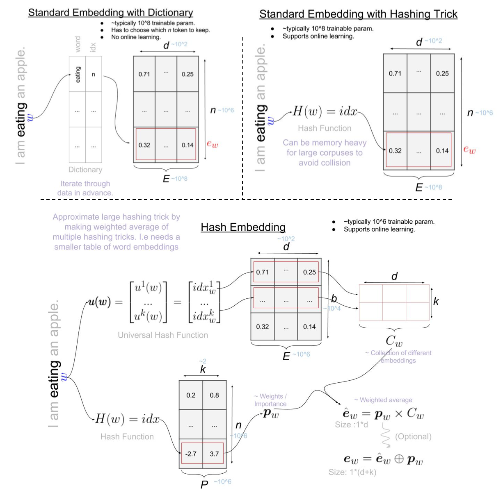
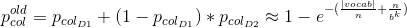
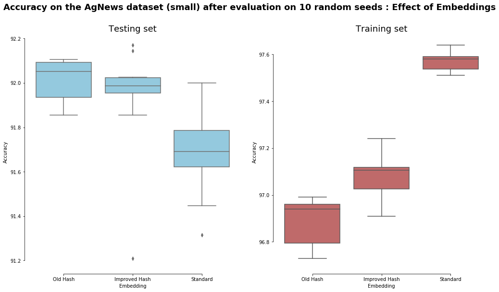
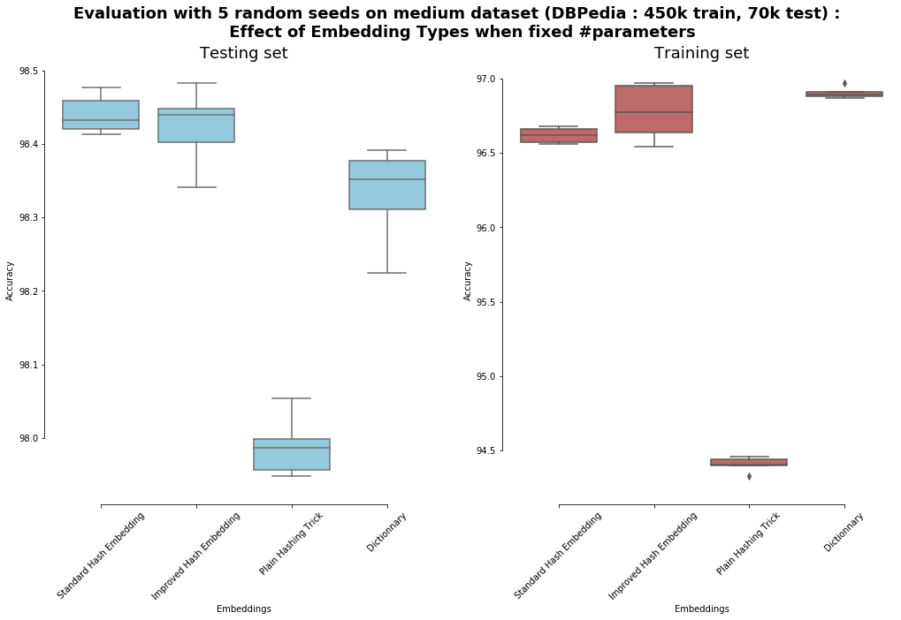
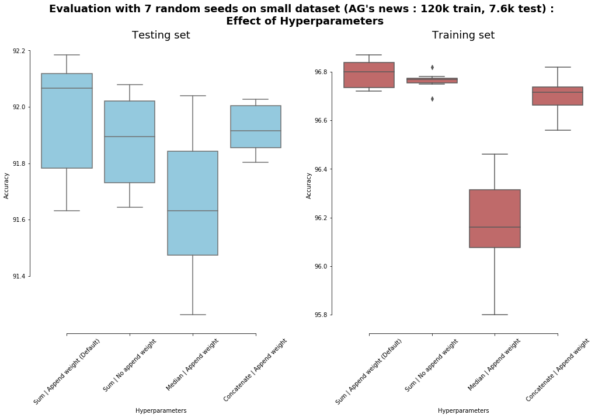

# Hash-Embeddings
PyTorch implementation of my [improved](#improvements) version of [Hash Embedding for efficient Representation](https://arxiv.org/abs/1709.03933) (NIPS 2017). Submission to the NIPS Implementation Challenge ([Featured Winner](https://medium.com/nurture-ai/yann-dubois-from-biomedical-engineering-to-machine-learning-9a5b87b7659b)).

The use of this directory is two-fold:
* Implementing an improved hash embedding layer in PyTorch. This can be found in the `./hashembed` folder. It works both for Python 2 and 3.
* Implementing an easy pipeline in PyTorch to evaluate a new NLP classification algorithm / a new type of embedding. This can be found in the `./evaluate` folder. This has only been tested on python 3. 

Hash Embedding are a **generalization of the hashing trick** in order to get a larger vocabulary with the same amount of parameters, or in other words it can be used to approximate the hashing trick using less parameters. The hashing trick (in the NLP context) is a popular technique where you use a hash table rather than a dictionnary for the word embeddings, which enables online learning (as the table's size is fixed with respect to the vocabulary size) and often helps against overfitting. 

See [my explanation of hashembeddings](#explanation) below for more details about the layer.


## Install

```bash
# clone repo
pip install -r requirements.txt
# install pytorch : http://pytorch.org/
```

## Use Hash Embeddings
If you only want to use the hashembedding:

```python
from hashembed import HashEmbedding
```

## Evaluate Hash Embedding
* Download and untar the [data](http://goo.gl/JyCnZq) in the `data` folder. If the link check [Xiang Zhang's Crepe directory on github](https://github.com/zhangxiangxiao/Crepe)

### Evaluate single model
* use `python evaluate/main <param>` to run a single experiment. If you want perfect replicabiility use, define the python hash seed with `PYTHONHASHSEED=0 python evaluate/main <param>`.

```
usage: main.py [-h]
               [-x {custom,std-embed-dict,hash-embed-dict,hash-embed-nodict,std-embed-nodict,ensemble-hash-embed-dict}]
               [-d {ag,amazon,amazon-polarity,dbpedia,sogou,yahoo,yelp,yelp-polarity}]
               [--no-shuffle] [--no-checkpoint] [--val-loss-callback]
               [-e EPOCHS] [-b BATCH_SIZE] [-v VALIDATION_SIZE] [-s SEED]
               [-p PATIENCE] [-V VERBOSE] [-P [PATIENCE [FACTOR ...]]]
               [--no-cuda] [-w NUM_WORKERS] [--dictionnary]
               [-g [MIN_NGRAM [MAX_NGRAM ...]]]
               [-f [MIN_FATURES [MAX_FATURES ...]]] [--no-hashembed]
               [--no-append-weight] [--old-hashembed] [-D DIM]
               [-B NUM_BUCKETS] [-N NUM_EMBEDING] [-H NUM_HASH]
               [-m {embed-softmax,embed-3L-softmax,ensemble-embed-3L-softmax}]

PyTorch implementation and evaluation of HashEmbeddings, which uses multiple
hashes to efficiently approximate an Embedding layer.

optional arguments:
  -h, --help            show this help message and exit

Predefined experiments:
  -x {custom,std-embed-dict,hash-embed-dict,hash-embed-nodict,std-embed-nodict,ensemble-hash-embed-dict}, --experiment {custom,std-embed-dict,hash-embed-dict,hash-embed-nodict,std-embed-nodict,ensemble-hash-embed-dict}
                        Predefined experiments to run. If different than
                        `custom` then only the dataset argument will be
                        considered. (default: custom)

Dataset options:
  -d {ag,amazon,amazon-polarity,dbpedia,sogou,yahoo,yelp,yelp-polarity}, --dataset {ag,amazon,amazon-polarity,dbpedia,sogou,yahoo,yelp,yelp-polarity}
                        path to training data csv. (default: ag)

Learning options:
  --no-shuffle          Disables shuffling batches when training. (default:
                        False)
  --no-checkpoint       Disables model checkpoint. I.e saving best model based
                        on validation loss. (default: False)
  --val-loss-callback   Whether should monitor the callbacks (early stopping ?
                        decrease LR on plateau/ ... on the loss rather than
                        accuracy on validation set. (default: False)
  -e EPOCHS, --epochs EPOCHS
                        Maximum number of epochs to run for. (default: 300)
  -b BATCH_SIZE, --batch-size BATCH_SIZE
                        Batch size for training. (default: 64)
  -v VALIDATION_SIZE, --validation-size VALIDATION_SIZE
                        Percentage of training set to use as validation.
                        (default: 0.05)
  -s SEED, --seed SEED  Random seed. (default: 1234)
  -p PATIENCE, --patience PATIENCE
                        Patience if early stopping. None means no early
                        stopping. (default: 10)
  -V VERBOSE, --verbose VERBOSE
                        Verbosity in [0,3]. (default: 3)
  -P [PATIENCE [FACTOR ...]], --plateau-reduce-lr [PATIENCE [FACTOR ...]]
                        If specified, if loss did not improve since PATIENCE
                        epochs then multiply lr by FACTOR. [None,None] means
                        no reducing of lr on plateau. (default: [4, 0.5])

Device options:
  --no-cuda             Disables CUDA training, even when have one. (default:
                        False)
  -w NUM_WORKERS, --num-workers NUM_WORKERS
                        Number of subprocesses used for data loading.
                        (default: 0)

Featurizing options:
  --dictionnary         Uses a dictionnary. (default: False)
  -g [MIN_NGRAM [MAX_NGRAM ...]], --ngrams-range [MIN_NGRAM [MAX_NGRAM ...]]
                        Range of ngrams to generate. ngrams in
                        [minNgram,maxNgram[. (default: [1, 3])
  -f [MIN_FATURES [MAX_FATURES ...]], --num-features-range [MIN_FATURES [MAX_FATURES ...]]
                        If specified, during training each phrase will have a
                        random number of features in range
                        [minFeatures,maxFeatures[. None if take all. (default:
                        [4, 100])

Embedding options:
  --no-hashembed        Uses the default embedding. (default: False)
  --no-append-weight    Whether to append the importance parameters. (default:
                        False)
  --old-hashembed       Uses the paper version of hash embeddings rather than
                        the improved one. (default: False)
  -D DIM, --dim DIM     Dimension of word vectors. Higher improves downstream
                        task for fixed vocabulary size. (default: 20)
  -B NUM_BUCKETS, --num-buckets NUM_BUCKETS
                        Number of buckets in the shared embedding table.
                        Higher improves approximation quality. (default:
                        1000000)
  -N NUM_EMBEDING, --num-embeding NUM_EMBEDING
                        Number of rows in the importance matrix. Approximate
                        the number of rows in a usual embedding. Higher will
                        increase possible vocabulary size. (default: 10000000)
  -H NUM_HASH, --num-hash NUM_HASH
                        Number of different hashes to use. Higher improves
                        approximation quality. (default: 2)

Model options:
  -m {embed-softmax,embed-3L-softmax,ensemble-embed-3L-softmax}, --model {embed-softmax,embed-3L-softmax,ensemble-embed-3L-softmax}
                        which model to use. Default is a simple softmax.
                        (default: embed-softmax)

 ```

### All Experiments
To get the same results as me, run all the following experiments (*Warning: computationally very intensive.*):
* `bin/no_dict_all.sh` : runs the experiments whithout dictionnary on all datasets.
* `bin/dict_all.sh` : runs the experiments whith dictionnary on all datasets. Note that as explained in the [results](#results) section, I haven't ran it completely.
* `bin/accuracy_distribution.sh` : runs the expirements whithout dictionnary on the 2 smallest datasets with 10 different random seed to see robustness of the model and results to the random seed.

## Explanation

In order to understand the advantages of Hash Embeddings and how they work it is probably a good idea to review and compare to a usual dictionnary and to the *hashing trick*.

Notation:
scalar *a*, matrix *M*, *i*th row in a matrix: ***m**=M[i]*, row vector ***v** = (v^1, ..., v^i, ...)*  , function *f()*.

-- General --
* *w_i* : word or token *i*.
* *d* : dimension of each word embedding.
* *E* : table containing all the word embeddings. Size: *n\*d*.
* ***e_w*** : vector embedding of word *w* (word embedding).
* *M[i]* : looks up index *i* in matrix *M*, returns the value in the table.
* *h(x)* : hash function returns the associated index with *x*.

-- Hash Embeddings --
* *u_i(x)* : universal hash function *i* (i.e "sampled hash function") returns the associated index with *x*.
* *k*: number of hash functions.
* *E* : table containing all the word embeddings. Size: *b\*d*.
* *P*: matrix containing the weight for doing the weighted average of the *k* embeddings. Size: *n\*k*. 
* *C_w*: matrix containing the *k* different word embeddings for word *w*. Size: *k\*d*. 

Nota Bene: In the paper *n* for hash embeddings is called *K* but to differentiate with *k* and for consistencz with teh hashing trick I use *n*.


### In Short

* **Usual Dictionnary**: 
    * Pretraining step: Loop through the corpus once and count how many times you see each words. Keep the *n* most common words. Initialize *E*.
    * Training step: loop over word *w* in corpus and update associated embedding in *E*: ***e_w** = E[w]* (size *1\*d*).
    * Online Training: hard.
    * Number of trainable parameters
* **Hashing Trick**:
    * Pretraining step: initalize *E*.
    * Training step: loop over word *w* in corpus and update associated embedding in *E* : ***e_w** = E[H(w)]* (size *1\*d*).
    * Online Training: trivially continue training.
* **Hashing Trick**:
    * Pretraining step: initalize *E* and *P*.
    * Training step: loop over word *w* in corpus and update *P* and *E* such that : ***p_w** = P[u_i(w)]* (size *1\*k*) and *C_w = (E[u_1(w)],...,E[u_k(w)])* (size *k\*d*) and ***e_w** = p_w \* C_w* (size *1\*d*).
    * Online Training: trivially continue training.

As we say, a picture is worth a million words. Let's save both of us some time :) :



## Improvements
I have improved the papers hash embeddings by 3 modification:

### Decreasing number of collisions for free 
 In the paper (when without dictionnary) they first use a hash function *D_1* (which I call *h*) with a range *[1,n]* and then they use the output of *D_1* both for the index of *P* (like me) and as input to *D_2* (which has the same output as my universal hash ***u***). This means that everytime there is a collision in *D_1* the final word embedding would be the same. In my implementation, you need to have a collision both in *h* and ***u*** in order to end up with the same word embedding (i.e same component embeddings and same weights).
Let's quantify the improvement:

**Theorem** (Theorem 4.1 of the paper, [birthday problem](https://en.wikipedia.org/wiki/Birthday_problem) in disguise)
Let *h* be a hash function with *|in|* input and *|out|* outputs. Then the probability *p_col* that *w_0 ∈ T*collides with one or more other tokens is given by (approximation for large *|out|*):


The number of collision is trivially : *nCol = p_col \* |in|*

In the papers implementation, 2 words would have the same word embedding (collision) if either *D_1* or *D_2* collides. I.e *p_col = p_col_D1 + (1-p_col_D1) \* p_col_D2* (only the tokens that did not colide in first layer can colide in second). For D1: *|in| = |vocab|*, *|out| = n*. For D2: *|in| = n*, *|out| = b^k*. So *p_col*:



In my implementation 2 words would have the same word embedding (collision) only if both *h* and ***u*** collided. I.e *p_col = p_col_h \* p_col_u* (independant). For *h*: *|in| = |vocab|*, *|out| = n*. For ***u***: *|in| = |vocab|*, *|out| = b^k*. So *p_col*:


This is a huge improvement. For example if we run the the experiment whithout dictionnary and limit the number of toke to *10^9*, i.e *|vocab| = 10^9*, *n=10^7*, *B=10^6*, *k=2* the *p_col_old≈1* while *p_col_new≈0.01*.

*Nota Bene: The authors mentionned this in the paper but they talked about adding a new hash function D_3 to do so, while I do it whithout adding a new hash function. The reason I think they didn't implement as I did is because this required a universal hashing function which I believe they weren't using (see the next improvement)*

### (slighlty) Decreasing memory use for free
From the [authors keras implmentation](https://github.com/dsv77/hashembedding), it seems that they implemented *D_2* as a table filled with *randint % b*. This explains also why they needed to use *D_2* on the output of an other hash *D_1* as they had to look up in the hashing table. This means that they had to store in memory and lookup *k* times per token in a table of hash of dimension *n\*k* (i.e same as *P*).

I removed thisby using a [universal family of hashing function](https://en.wikipedia.org/wiki/Universal_hashing), to generate *k* independent hashes.

### Add different aggregation methods of the hashed embeddings
In the paper the authors would first multiply each component vector *C_w[i]* by *p_w* then sum all of these (***e_w** = p_w \* C_w*). This makes a lot of sense as it inutitively makes a weighted average of the different component vectors. I extended this by giving the possibility of concatenating the weighted vectors or taking the median of them (note that mean should do the same as sum as the the weights are learnable so they could learn to divide them selves by *k* to make a weighted average rather than a weighted sum). 


## Results
* Datasets : *from Table 1 in the paper.*

| Dataset                | #Train | #Test | #Classes | Task                        |
| :--------------------- |:-----: | :---: |:--------:| :---------------------------|
| AG’s news              | 120k   | 7.6k  |4         | English news categorization |
| DBPedia                | 450k   | 70k   |14        | Ontology classification     |
| Yelp Review Polarity   | 560k   | 38k   |2         | Sentiment analysis          |
| Yelp Review Full       | 560k   | 50k   |5         | Sentiment analysis          |
| Yahoo! Answers         | 650k   | 60k   |10        | Topic classification        |
| Amazon Review Full     | 3000k  | 650k  |5         | Sentiment analysis          |
| Amazon Review Polarity | 3600k  | 400k  |2         | Sentiment analysis          |

* Preprocessing : 
    * Remove punctuation, lowercase, remove single characters. Note that I used the default Keras preprocessing as it's the papers framework, but I now realized it was written that they only remove punctuation, I didn't have the time to rerun everything.
    * Converts to n-grams. 
    * Select randomly between 4-100 n-grams as input (~dropout). 
* Training:
    * Sum n-gram embedding to make phrase emebdding.
    * Adam optimizer.
    * Learning rate = 0.001.
    * Early stooping with patience = 10.
    * 5% of train set used for validation.

In order to compare to the results in the paper I ran the same experiments:
1. **Without a dictionnary**: embedding followed by a softmax.
    * Standard Embeddings : 
        * Hyper parameters: *n = 10^7*, *d = 20*, ngram range : *[1,3[*. 
        * Number of trainable parameters : *200 * 10^6*
    * Hash Embeddings : 
        * Hyper parameters: *n = 10^7*, *k = 2*, *b = 10^6*, *d = 20*, ngram range : *[1,3[*. 
        * Number of trainable parameters : *40 * 10^6*.
2. **With a dictionnary**: embedding followed by 3 fully connected layers with *1000* hidden units and ReLu activation. Then ends in softmax layer. With batch normalization.
    * Standard Embeddings : 
        * Hyper parameters: *n = cross-validate([10K, 25K, 50K, 300K, 500K, 1M])*, *d = 200*, ngram range : *[1,10[*. 
        * Number of trainable parameters : ...
    * Hash Embeddings : 
        * Hyper parameters: *n = 10^6*, *k = 2*, *b = cross-validate([500, 10K, 50K, 100K, 150K])*, *d = 200*, ngram range : *[1,10[*. 
        * Number of trainable parameters : ...

### My Results

#### Replication of Paper

Please note that currently I only ran all the experimenths without dictionnary (although I ran with a dictionnary on 2 datasets, and all the code is in the package). I decided to do so because:

* Using hashing rather than dictionnary is probably the most useful in practice (better results and enables online learning).
* The results without dictionnary are the ones where hash embeddings seem to do a lot better than.
* I didn't have the computational power to run cross validation on neural networks for large datsets (using cv on real problems also seems less likely).
* I wanted to show that the hash embeddings were working, and then spend some time on improving them.
* I was able to replicate the results with a dictionnary for 2 datasets, so though that it wouldn't add so much to test on the others.


|                                        | **No Dict.** &<br/>Hash Emb. | **No Dict.** &<br/>Std Emb. |
| :---------------------                 |:---------:|:-------: |
| **# of Parameters**                    | 40M       | 200M     |
|                                        |           |          | 
| AG’s news (#train: 120k)               | **92.1**  | 91.9     | 
| Amazon Review Full (#train: 450k)      | **59.1**  | 58.8     |
| DBPedia (#train: 450k)                 | **98.7**  | 98.5     | 
| Yahoo! Answers (#train: 650k)          | 72.9      | **73.1** |
| Yelp Review Full (#train: 560k)        | **62.5**  | 62.1     |
| Amazon Review Polarity (#train: 3000k) | **94.3**  | 94.2     |
| Yelp Review Polarity (#train: 560k)    | **95.8**  | 95.6     |

The difference between hashembeddings and standard embeddings seems consistent with the papers result (Hashembedding is always better besides 1 dataset. In our case Yahoo, in the paper DBPedia). It seems that the average accuracy is slighly lower for both than in the paper, this might be because:

* I only used a single seed, no cherry picking.
* I didn't do any hyperparameters optimization.
* I used either Pytorch defaults initialization / defaults or the ones from Keras. I often used Keras defaults as the authors used this frameowrk and I was hoping they kept the default parameters for better replicability.

#### Personal Improvements

In order to investigate the effects of my [improvements](#improvements) and of the hyperparameter "append weight" (the optional step of appending the importance weights ***p*** to ***e_w***), I ran a few experiments. Because the effects of each components might be less important than the variabilty due to the seed, I ran the experiment multiple times to make a more robust conclusion. This might also give some idea about the statistical significance of some of the papers and my results. As this [nice paper](https://arxiv.org/pdf/1707.09861.pdf) reminds us: looking at the distribution matters! Unfortunately I don't have the computational power to run large experiments multiple times so I decided to run only for smaller datasets. Because I chose the smaller datasets of the ones we have above, I divided both *b* and *n* by 5 in order to understand if some methods need less parameters.

*Nota Bene: yhe evaluation on the training set is the evaluation during training phase, i.e I still sample randomlyn-grams from the text (the accuracy would be around 1 if not)*

##### Decreasing Number of Collisions for free 





From the plots we see that the old and the new hash-embeddings are significantly different on the test set, although it seems that the greater number of collision in the standard hash embeddings might have a regularization effect (at least on this small dataset). Indeed the results on the training set seems significantly higher with the improved hash embeddings. 

The first plot also seems to indicate that the "Ag News" dataset should have been used to evaluate a model with less parameters, indeed it seems that the large number of parameters in standard embeddings only makes it overfit.

The second plot is interesting as it shows that the hash-embeddings do indeed work better when there are the same number of parameters. Interestingly it seems to indicate that hash-embeddings work just as well as using a dictionary with the same amount of parameters. I.e there's no more reason (besides simplicity) to use a dictionary instead of hash embeddings.

##### Different Aggregation Methods



From this plot we see that the default hyperparameters seem to be the best (sum and append weights). Although appending weights doesn't seem to give a statistically significant result difference in our case.

### Paper's Results

*from Table 2 in the paper:*

|                                        | **No Dict.** &<br/>Hash Emb. | **No Dict.** &<br/>Std Emb. | **Dict.** &<br/>Hash Emb.| **Dict.** &<br/>Std Emb. | **Dict.** &<br/>Ensemble Hash Emb. |
| :---------------------                 |:---------:|:-------: |:--------:   | :-------:   |:------------------:|
| **# of Parameters**                    | 40M       | 200M     | Unspecified | Unspecified |                    |
|                                        |           |          |             |             |                    |
| AG’s news (#train: 120k)               | **92.4**  | 92.0     |91.5         | 91.7        | 92.0               |
| Amazon Review Full (#train: 450k)      | 60.0      | 58.3     |59.4         | 58.5        | **60.5**           |
| DBPedia (#train: 560k)                 | 98.5      | 98.6     |98.7         | 98.6        | **98.8**           |
| Yahoo! Answers (#train: 560k)          | 72.3      | 72.3     |71.3         | 65.8        | **72.9**           |
| Yelp Review Full (#train: 650k)        | **63.8**  | 62.6     |62.6         | 61.4        | 62.9               |
| Amazon Review Polarity (#train: 3000k) | 94.4      | 94.2     |94.7         | 93.6        | **94.7**           |
| Yelp Review Polarity (#train: 3600k)   | **95.9**  | 95.5     |95.8         | 95.0        | 95.7               |


